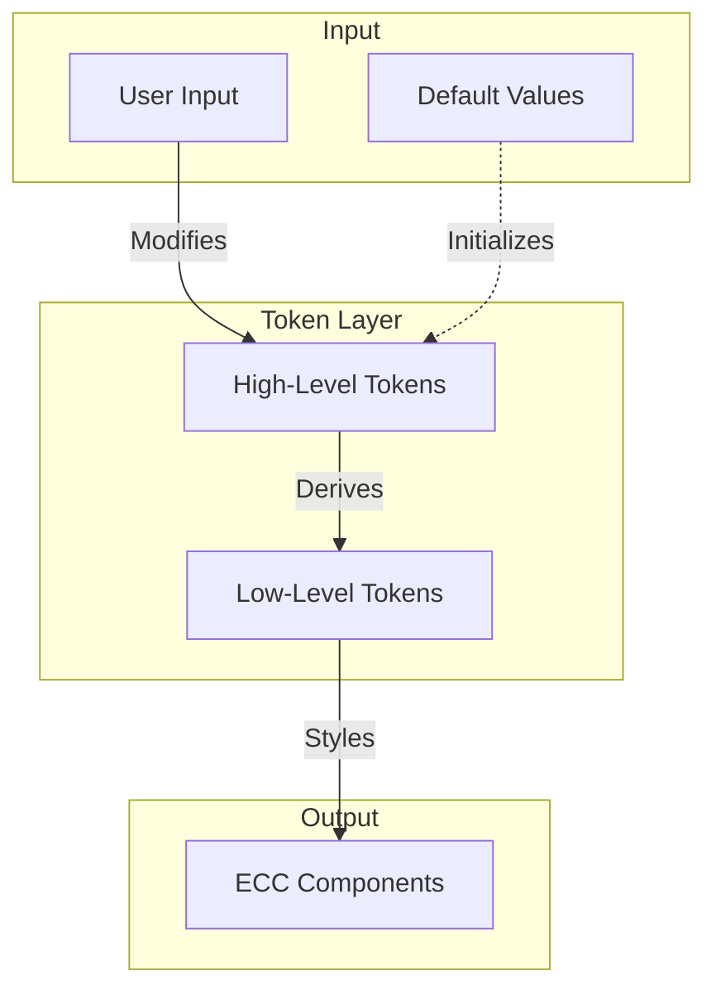

# Customizing

This documentation explains how to customize the suite of ELIXIR Cloud Components (ECC) to suit your specific requirements.
This allows you to modify the appearance, behavior, and functionality of the components to better align with your application's design and user experience.

## Architecture

The ELIXIR Cloud Components (ECC) suite employs a robust and flexible customization architecture that allows for easy theming and adaptation to various design requirements. 
This system is built on a hierarchy of design tokens, ranging from high-level, user-configurable options to low-level CSS variables that directly affect the component styles.

### Token Hierarchy

- High-Level Tokens (Adaptive UI): These are the primary customization points for users. They represent broad design concepts and are easy to understand and modify.
- Low-Level Tokens (CSS): These are derived from the high-level tokens and provide more granular control over the component styles. They are implemented as CSS custom properties (variables).


### Customization Flow

- Users modify high-level tokens to match their design requirements.
- The ECC system automatically recalculates all affected low-level tokens.
- Components instantly reflect the changes, updating their appearance accordingly.



## Design Tokens

User can modify the appearance of ECC components by changing the following tokens.

### High-Level Tokens

High-level tokens are the primary customization points for users. They represent broad design concepts and are easy to understand and modify. The following table lists all the available high-level tokens:

| Token Name | Description | Default Value |
|------------|-------------|---------------|
| --ecc-color-brand | The primary brand color | hsl(217, 91%, 60%) |
| --ecc-color-warning | Color used for warning states | hsl(38, 92%, 50%) |
| --ecc-color-danger | Color used for error or danger states | hsl(0, 84%, 60%) |
| --ecc-color-success | Color used for success states | hsl(142, 71%, 45%) |
| --ecc-color-neutral | Base color for neutral shades | hsl(240, 4%, 46%) |
| --ecc-corner | Base value for border radius | 0.5rem |
| --ecc-depth | Intensity of shadows and depth effects | 1 |
| --ecc-density | Base value for spacing and layout density | 0.5rem |
| --ecc-sizing | Base value for component sizing | 0.9rem |
| --ecc-motion | Duration for animations and transitions | 250ms |
| --ecc-font-size | Base font size | 0.9rem |

### Low-Level Tokens

Low-level tokens are derived from the high-level tokens and provide more granular control over the component styles. Users can modify these tokens to achieve fine-grained customization of the components.

For a comprehensive list of all low-level tokens, please refer to the [Primitive Stylesheet](https://github.com/elixir-cloud-aai/cloud-components/blob/main/packages/ecc-utils-design/src/styles/primitive.styles.ts).

### Customizing Tokens

To customize the appearance of ECC components, you can modify the tokens in your application's CSS.

Here's an example of how to customize the brand color:

```css
:root {
  --ecc-color-brand: hsl(280, 80%, 50%); /* Change to a purple hue */
}
```

This change will affect all components and styles that use the brand color, providing a consistent update across your application.

OR for the more granular control, you can modify the low-level tokens directly:

```css
:root {
    --ecc-color-primary-50: hsl(280, 80%, 50%); /* Change the primary color to a purple hue */
}
```