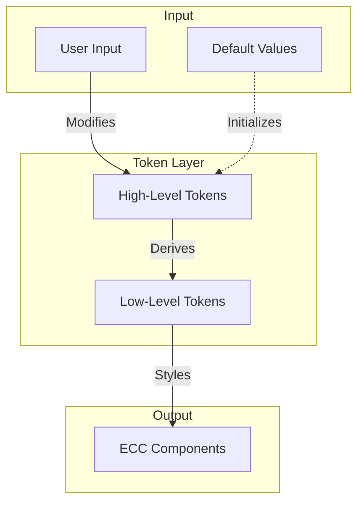

# Customizing

This page explains how to customize the suite of ELIXIR Cloud Components (ECC) to suit your specific requirements.
This allows you to modify the appearance, behavior, and functionality of the components to better align with your application's design and user experience.

## Architecture

The ELIXIR Cloud Components (ECC) suite employs a robust and flexible customization architecture that allows for easy theming and adaptation to various design requirements. 
This system is built on a hierarchy of design tokens, ranging from high-level, user-configurable options to low-level CSS variables that directly affect the component styles.

### Token Hierarchy

- High-Level Tokens (Adaptive UI): These are the primary customization points for users. They represent broad design concepts and are easy to understand and modify.
- Low-Level Tokens (CSS): These are derived from the high-level tokens and provide more granular control over the component styles. They are implemented as CSS custom properties (variables).

### Customization Flow

- Users modify high-level tokens to match their design requirements.
- The ECC system automatically recalculates all affected low-level tokens.
- Components instantly reflect the changes, updating their appearance accordingly.

