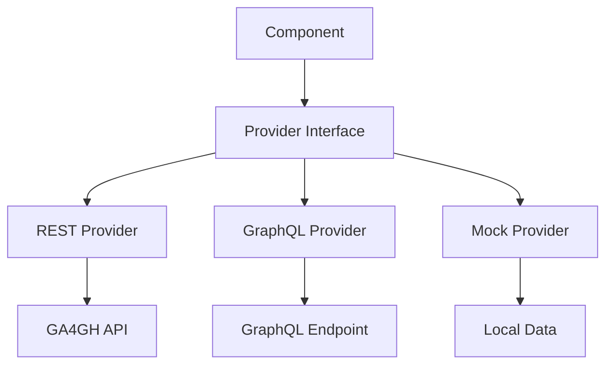

import { Callout, Tabs, Cards, Card } from 'nextra/components'

# Providers Overview

Providers are the data layer for all ECC (Elixir Cloud Components) packages. They abstract the communication with various GA4GH APIs and services, allowing components to work with different data sources while maintaining a consistent interface.

<Callout type='info'>
  **How it works**: Create a provider instance with your API endpoint, pass it to any compatible component, and the component handles all data fetching automatically.
</Callout>

## How Providers Work

### Architecture Overview



### Basic Pattern

All ECC providers follow the same pattern:

1. **Create** a provider with your API endpoint
2. **Pass** it to components via props
3. **Components** automatically fetch data using the provider
4. **Handle** loading states and errors in your UI

```tsx
// 1. Create provider
const provider = new RestProvider('https://api.example.com');

// 2. Pass to component
<Component provider={provider} />

// 3. Component uses provider internally
// 4. Handle events/states as needed
```

## Common Use Cases

### Environment-Based Configuration

Manage different API endpoints across environments:

<Tabs items={['React Hook', 'Configuration Object', 'Environment Factory']}>
  <Tabs.Tab>
    ```tsx copy
    // hooks/useProviders.js
    import { useMemo } from 'react';

    export function useProviders() {
      return useMemo(() => {
        const env = process.env.NODE_ENV || 'development';
        const baseUrls = {
          development: 'http://localhost:8080',
          staging: 'https://staging-api.example.com',
          production: 'https://api.example.com'
        };

        return {
          serviceRegistry: new RestServiceRegistryProvider(`${baseUrls[env]}/ga4gh/registry/v1`),
          wes: new RestWesProvider(`${baseUrls[env]}/ga4gh/wes/v1`),
          trs: new RestTrsProvider(`${baseUrls[env]}/ga4gh/trs/v2`)
        };
      }, []);
    }

    // Usage in components
    function MyApp() {
      const providers = useProviders();
      return <ServiceList provider={providers.serviceRegistry} />;
    }
    ```
  </Tabs.Tab>
  <Tabs.Tab>
    ```tsx copy
    // config/providers.js
    export const providerConfig = {
      development: {
        serviceRegistry: 'http://localhost:8080/ga4gh/registry/v1',
        wes: 'http://localhost:8081/ga4gh/wes/v1',
        trs: 'http://localhost:8082/ga4gh/trs/v2'
      },
      production: {
        serviceRegistry: 'https://registry.example.com/ga4gh/registry/v1',
        wes: 'https://wes.example.com/ga4gh/wes/v1',
        trs: 'https://trs.example.com/ga4gh/trs/v2'
      }
    };

    export function getProviderConfig(env = process.env.NODE_ENV) {
      return providerConfig[env] || providerConfig.development;
    }
    ```
  </Tabs.Tab>
  <Tabs.Tab>
    ```tsx copy
    // providers/factory.js
    export class ProviderFactory {
      static create(type, environment = 'development') {
        const configs = {
          development: { baseUrl: 'http://localhost:8080' },
          production: { baseUrl: 'https://api.example.com' }
        };

        const config = configs[environment];
        
        switch (type) {
          case 'serviceRegistry':
            return new RestServiceRegistryProvider(`${config.baseUrl}/ga4gh/registry/v1`);
          case 'wes':
            return new RestWesProvider(`${config.baseUrl}/ga4gh/wes/v1`);
          case 'trs':
            return new RestTrsProvider(`${config.baseUrl}/ga4gh/trs/v2`);
          default:
            throw new Error(`Unknown provider type: ${type}`);
        }
      }
    }

    // Usage
    const provider = ProviderFactory.create('serviceRegistry', 'production');
    ```
  </Tabs.Tab>
</Tabs>

### Authentication Patterns

#### API Key Authentication

```tsx copy
// Base authenticated provider class
class AuthenticatedProvider {
  constructor(baseProvider, apiKey, keyHeader = 'X-API-Key') {
    this.baseProvider = baseProvider;
    this.apiKey = apiKey;
    this.keyHeader = keyHeader;
  }

  // Wrap all provider methods with authentication
  async makeRequest(url, options = {}) {
    return fetch(url, {
      ...options,
      headers: {
        [this.keyHeader]: this.apiKey,
        'Content-Type': 'application/json',
        ...options.headers
      }
    });
  }
}

// Apply to any provider
function withApiKey(Provider, apiKey) {
  return class extends Provider {
    async fetch(url, options = {}) {
      return super.fetch(url, {
        ...options,
        headers: {
          'X-API-Key': apiKey,
          ...options.headers
        }
      });
    }
  };
}

// Usage
const AuthenticatedServiceRegistryProvider = withApiKey(RestServiceRegistryProvider, 'your-api-key');
const provider = new AuthenticatedServiceRegistryProvider('https://api.example.com');
```

#### Bearer Token Authentication

```tsx copy
// Token-based authentication
class TokenProvider {
  constructor(BaseProvider, getToken) {
    this.BaseProvider = BaseProvider;
    this.getToken = getToken;
  }

  async createProvider(baseUrl) {
    const token = await this.getToken();
    
    return new (class extends this.BaseProvider {
      async fetch(url, options = {}) {
        return super.fetch(url, {
          ...options,
          headers: {
            'Authorization': `Bearer ${token}`,
            ...options.headers
          }
        });
      }
    })(baseUrl);
  }
}

// Usage with OAuth
const tokenProvider = new TokenProvider(RestWesProvider, () => oauth.getAccessToken());
const wesProvider = await tokenProvider.createProvider('https://wes.example.com/ga4gh/wes/v1');
```

#### Custom Headers

```tsx copy
// Custom headers for organization, versioning, etc.
function withCustomHeaders(Provider, headers) {
  return class extends Provider {
    constructor(baseUrl) {
      super(baseUrl);
      this.customHeaders = headers;
    }

    async fetch(url, options = {}) {
      return super.fetch(url, {
        ...options,
        headers: {
          ...this.customHeaders,
          ...options.headers
        }
      });
    }
  };
}

// Usage
const OrganizationalProvider = withCustomHeaders(RestServiceRegistryProvider, {
  'X-Organization': 'my-org',
  'X-Client-Version': '1.0.0',
  'X-Request-ID': () => generateRequestId()
});
```

### Error Handling Patterns

#### Centralized Error Handling

```tsx copy
// Global error handler
class ErrorHandlingProvider {
  constructor(baseProvider, errorHandler) {
    this.baseProvider = baseProvider;
    this.errorHandler = errorHandler;
  }

  // Wrap all methods with error handling
  async wrapMethod(methodName, ...args) {
    try {
      return await this.baseProvider[methodName](...args);
    } catch (error) {
      return this.errorHandler(error, methodName, args);
    }
  }
}

// Error handler function
function handleProviderError(error, method, args) {
  console.error(`Provider error in ${method}:`, error);
  
  // Log to monitoring service
  analytics.track('provider_error', {
    method,
    error: error.message,
    endpoint: args[0]
  });
  
  // Transform error for user
  if (error.message.includes('404')) {
    throw new Error('Resource not found. Please check your configuration.');
  } else if (error.message.includes('401')) {
    throw new Error('Authentication failed. Please check your credentials.');
  } else if (error.message.includes('network')) {
    throw new Error('Network error. Please check your connection.');
  }
  
  throw error; // Re-throw if no specific handling
}
```

#### Retry Logic

```tsx copy
// Retry wrapper for transient failures
function withRetry(Provider, maxRetries = 3, delay = 1000) {
  return class extends Provider {
    async fetch(url, options = {}) {
      let lastError;
      
      for (let i = 0; i <= maxRetries; i++) {
        try {
          return await super.fetch(url, options);
        } catch (error) {
          lastError = error;
          
          // Don't retry on client errors
          if (error.status >= 400 && error.status < 500) {
            throw error;
          }
          
          if (i < maxRetries) {
            await new Promise(resolve => setTimeout(resolve, delay * (i + 1)));
          }
        }
      }
      
      throw lastError;
    }
  };
}

// Usage
const RetryableProvider = withRetry(RestWesProvider, 3, 1000);
const provider = new RetryableProvider('https://api.example.com');
```

### Caching and Performance

#### Request Caching

```tsx copy
// Simple memory cache
class CachedProvider {
  constructor(baseProvider, ttl = 300000) { // 5 minutes default
    this.baseProvider = baseProvider;
    this.cache = new Map();
    this.ttl = ttl;
  }

  generateCacheKey(method, args) {
    return `${method}:${JSON.stringify(args)}`;
  }

  async cachedRequest(method, ...args) {
    const key = this.generateCacheKey(method, args);
    const cached = this.cache.get(key);
    
    if (cached && Date.now() - cached.timestamp < this.ttl) {
      return cached.data;
    }
    
    const data = await this.baseProvider[method](...args);
    this.cache.set(key, { data, timestamp: Date.now() });
    
    return data;
  }

  // Cache service info (rarely changes)
  async getServiceInfo() {
    return this.cachedRequest('getServiceInfo');
  }

  // Don't cache user-specific data
  async getServices() {
    return this.baseProvider.getServices();
  }
}
```

#### Request Deduplication

```tsx copy
// Prevent duplicate concurrent requests
class DeduplicatedProvider {
  constructor(baseProvider) {
    this.baseProvider = baseProvider;
    this.pendingRequests = new Map();
  }

  async deduplicatedRequest(method, ...args) {
    const key = `${method}:${JSON.stringify(args)}`;
    
    if (this.pendingRequests.has(key)) {
      return this.pendingRequests.get(key);
    }
    
    const promise = this.baseProvider[method](...args)
      .finally(() => this.pendingRequests.delete(key));
    
    this.pendingRequests.set(key, promise);
    return promise;
  }
}
```

### Testing Patterns

#### Mock Providers

```tsx copy
// Mock provider for testing
export class MockServiceRegistryProvider {
  constructor(mockData = {}) {
    this.mockData = {
      services: [],
      serviceInfo: { name: 'Mock Registry' },
      ...mockData
    };
  }

  async getServices() {
    // Simulate network delay
    await new Promise(resolve => setTimeout(resolve, 100));
    return this.mockData.services;
  }

  async getServiceById(id) {
    await new Promise(resolve => setTimeout(resolve, 100));
    return this.mockData.services.find(s => s.id === id);
  }

  async getServiceInfo() {
    await new Promise(resolve => setTimeout(resolve, 50));
    return this.mockData.serviceInfo;
  }

  // Add method to update mock data during tests
  updateMockData(newData) {
    this.mockData = { ...this.mockData, ...newData };
  }
}

// Usage in tests
const mockProvider = new MockServiceRegistryProvider({
  services: [
    { id: 'service-1', name: 'Test Service 1' },
    { id: 'service-2', name: 'Test Service 2' }
  ]
});
```

#### Provider Testing Utilities

```tsx copy
// Test utilities for any provider
export class ProviderTester {
  constructor(provider) {
    this.provider = provider;
    this.results = [];
  }

  async testMethod(methodName, ...args) {
    const startTime = Date.now();
    
    try {
      const result = await this.provider[methodName](...args);
      const duration = Date.now() - startTime;
      
      this.results.push({
        method: methodName,
        status: 'success',
        duration,
        result: result ? 'data received' : 'no data'
      });
      
      return result;
    } catch (error) {
      const duration = Date.now() - startTime;
      
      this.results.push({
        method: methodName,
        status: 'error',
        duration,
        error: error.message
      });
      
      throw error;
    }
  }

  getTestResults() {
    return this.results;
  }

  async runHealthCheck() {
    try {
      await this.testMethod('getServiceInfo');
      console.log('✅ Provider health check passed');
      return true;
    } catch (error) {
      console.error('❌ Provider health check failed:', error.message);
      return false;
    }
  }
}

// Usage
const tester = new ProviderTester(myProvider);
await tester.runHealthCheck();
console.table(tester.getTestResults());
```

## Multi-Provider Applications

### Provider Context

```tsx copy
// React context for managing multiple providers
import { createContext, useContext } from 'react';

const ProviderContext = createContext();

export function ProviderProvider({ children, providers }) {
  return (
    <ProviderContext.Provider value={providers}>
      {children}
    </ProviderContext.Provider>
  );
}

export function useProvider(type) {
  const providers = useContext(ProviderContext);
  if (!providers || !providers[type]) {
    throw new Error(`Provider ${type} not found`);
  }
  return providers[type];
}

// Usage
function App() {
  const providers = {
    serviceRegistry: new RestServiceRegistryProvider('https://registry.example.com'),
    wes: new RestWesProvider('https://wes.example.com'),
    trs: new RestTrsProvider('https://trs.example.com')
  };

  return (
    <ProviderProvider providers={providers}>
      <ServiceList />
      <WorkflowSubmitter />
      <ToolBrowser />
    </ProviderProvider>
  );
}

function ServiceList() {
  const provider = useProvider('serviceRegistry');
  return <EccClientGa4ghServiceRegistryServices provider={provider} />;
}
```

### Provider Composition

```tsx copy
// Compose multiple providers for complex workflows
class CompositeWorkflowProvider {
  constructor(serviceRegistryProvider, wesProvider, trsProvider) {
    this.serviceRegistry = serviceRegistryProvider;
    this.wes = wesProvider;
    this.trs = trsProvider;
  }

  // High-level workflow operations
  async discoverAndRunWorkflow(workflowQuery) {
    // 1. Find workflow in TRS
    const tools = await this.trs.getToolsList(10, 0, {}, workflowQuery);
    const workflow = tools.find(t => t.toolclass.name === 'Workflow');
    
    if (!workflow) {
      throw new Error('Workflow not found');
    }

    // 2. Find compatible WES service
    const services = await this.serviceRegistry.getServices();
    const wesService = services.find(s => 
      s.type.artifact === 'wes' && 
      s.organization.name === workflow.organization
    );
    
    if (!wesService) {
      throw new Error('No compatible WES service found');
    }

    // 3. Submit workflow
    const runRequest = {
      workflow_url: workflow.url,
      workflow_type: workflow.versions[0].descriptor_type[0],
      workflow_params: {}
    };
    
    return await this.wes.runWorkflow(runRequest);
  }
}
```

## Best Practices

### 1. Provider Lifecycle

```tsx copy
// Proper provider lifecycle management
function useProviderLifecycle(createProvider) {
  const [provider, setProvider] = useState(null);
  const [loading, setLoading] = useState(true);
  const [error, setError] = useState(null);

  useEffect(() => {
    let cancelled = false;

    async function initProvider() {
      try {
        setLoading(true);
        const newProvider = await createProvider();
        
        if (!cancelled) {
          setProvider(newProvider);
          setError(null);
        }
      } catch (err) {
        if (!cancelled) {
          setError(err);
        }
      } finally {
        if (!cancelled) {
          setLoading(false);
        }
      }
    }

    initProvider();

    return () => {
      cancelled = true;
      // Cleanup provider if needed
      if (provider?.cleanup) {
        provider.cleanup();
      }
    };
  }, [createProvider]);

  return { provider, loading, error };
}
```

### 2. Error Boundaries

```tsx copy
// Error boundary for provider failures
class ProviderErrorBoundary extends React.Component {
  constructor(props) {
    super(props);
    this.state = { hasError: false, error: null };
  }

  static getDerivedStateFromError(error) {
    return { hasError: true, error };
  }

  componentDidCatch(error, errorInfo) {
    console.error('Provider error:', error, errorInfo);
    
    // Report to error tracking service
    if (this.props.onError) {
      this.props.onError(error, errorInfo);
    }
  }

  render() {
    if (this.state.hasError) {
      return (
        <div className="provider-error">
          <h3>Connection Error</h3>
          <p>Unable to connect to the service. Please check your configuration.</p>
          <button onClick={() => this.setState({ hasError: false, error: null })}>
            Retry
          </button>
        </div>
      );
    }

    return this.props.children;
  }
}
```

### 3. Performance Monitoring

```tsx copy
// Monitor provider performance
class MonitoredProvider {
  constructor(baseProvider, onMetrics) {
    this.baseProvider = baseProvider;
    this.onMetrics = onMetrics;
  }

  async wrapMethod(methodName, ...args) {
    const startTime = performance.now();
    const requestId = generateId();
    
    try {
      const result = await this.baseProvider[methodName](...args);
      const duration = performance.now() - startTime;
      
      this.onMetrics({
        requestId,
        method: methodName,
        duration,
        status: 'success',
        timestamp: Date.now()
      });
      
      return result;
    } catch (error) {
      const duration = performance.now() - startTime;
      
      this.onMetrics({
        requestId,
        method: methodName,
        duration,
        status: 'error',
        error: error.message,
        timestamp: Date.now()
      });
      
      throw error;
    }
  }
}
```

## Next Steps

- **Package-specific documentation**: See individual provider documentation for REST implementations and interfaces:
  - [Service Registry Providers](/docs/service-registry/providers) - Browse GA4GH service registries
  - [Cloud Registry Providers](/docs/cloud-registry/providers) - Create and manage services  
  - [WES Providers](/docs/wes/providers) - Submit and monitor workflows
  - [TRS Providers](/docs/trs/providers) - Browse tools and workflows
  - [TRS Filer Providers](/docs/trs-filer/providers) - Create and manage tools

- **Component documentation**: Learn how to use providers with specific components in each package's component documentation

- **Examples**: Check the demo applications in each package for complete implementation examples

<Callout type='tip'>
  **Pro tip**: Start with the basic REST provider from the package you need, then apply the patterns from this guide to add authentication, error handling, and other features as needed.
</Callout> 