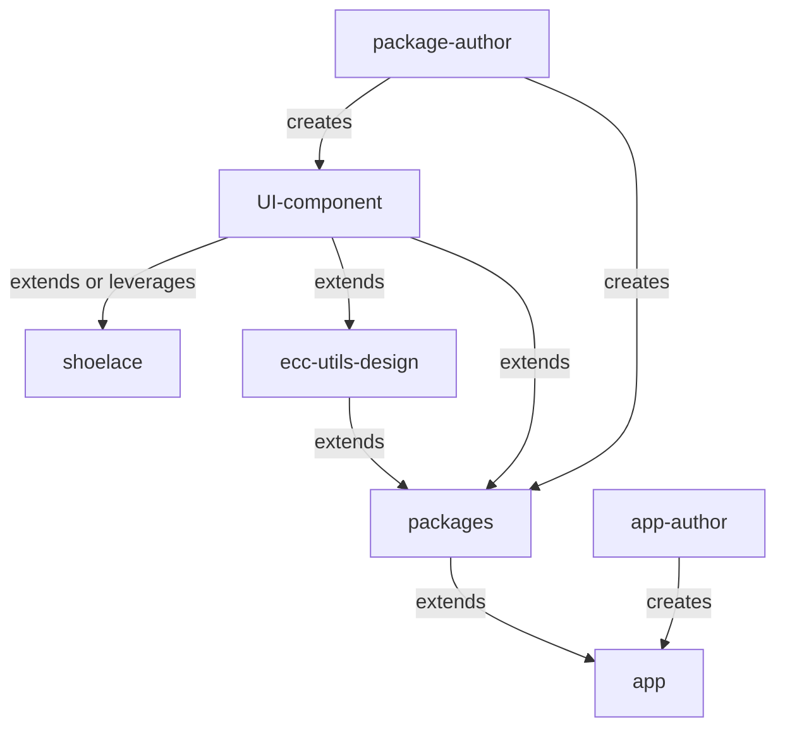

# Developers Docs

Guide to development of `ecc cloud components`.

## Web Components

Web Components are reusable pieces of code that can be embedded in any web page. ECC's `cloud component` aims to be highly customizable on many levels such as styles and configurations. These component are be framework agnostic supporting all the major web frameworks.
For more reference read [webcomponents.org](https://www.webcomponents.org/introduction) and [w3.org](https://www.w3.org/wiki/WebComponents/).

## Monorepo

`cloud-components` uses a monorepo approach, the project is setup using [turborepo](https://turbo.build/).
Below is the a brief explanation of needs/roles of different directories and files.

```
.
├── apps                        // Contains docs and code for elixir-cloud-components.vercel.app
|
├── package.json                // Contains monorepo level package and scripts
|
├── packages                    // Contains packages, this is where most work is done, new package
|   |                           // are created, they follow a set naming pattern, to create new package
|   |                           // use the command `npm run new` in root directory.
|   |
│   ├── ecc-client-elixir-trs-filer
│   ├── ecc-client-ga4gh-tes
│   ├── ecc-client-ga4gh-trs
│   ├── ecc-client-ga4gh-wes
│   ├── ecc-client-lit-ga4gh-tes
│   ├── ecc-client-lit-ga4gh-wes
│   ├── ecc-utils-design        // Contains the code design package which is leveraged by other
|   |   |                       // packages to keep design consistent, default to this package
|   |   |                       // to see organizational pattern for a new package, this package
|   |   |                       // follows an agreed upon pattern which eventually other package
|   |   |                       // will follow.
|   |   |
│   │   ├── package.json        // Each package has its own set of dependencies and scripts that
|   |   |                       // are mentioned here. `package-author` has free rein to take
|   |   |                       // as much decisions as they want, but they should comply to some
|   |   |                       // specifications for consistency:
|   |   |                       // - Each package should have `build`, `dev`, `lint`, `lint:fix`,
|   |   |                       //   `test`, this is because turbo runs all these scripts of each
|   |   |                       //   individual package.
|   |   |                       // - Packages should follow the naming conventions and file
|   |   |                       //   hierarchy within the package, this helps in build and defining
|   |   |                       //   types. To know more explore design package (ecc-utils-design).
|   |   |
│   │   ├── README.md
│   │   ├── tsconfig.json
│   │   ├── tsconfig.prod.json
│   │   ├── web-dev-server.config.mjs // Contains specifications for dev server of the
|   |   |                             // package, should have unique port for each package so
|   |   |                             // that packages don't conflict when `dev` for all the
|   |   |                             // packages are run simultaneously.
|   |   |
│   │   └── web-test-runner.config.mjs // Contains specification for test runner.
|   |
│   └── eslint-config-elixir    // Another important package, this defines the code structure
|                               // and linting rules for the entire monorepo to have consistent
|                               // base configurations, `package-author` can always extend
|                               // these rules as per need.
|
├── README.md                   // README like this one ;)
├── turbo
│   └── generators              // Contains handlebar files that are used to generate templates for
|                               // new packages or repetitive work. This is based on plopJs, see turbo
|                               // docs for more info.
|
└── turbo.json                  // Contains monorepo level configurations, such as build pipelines etc.

```

ECC package follow develop on best practices for development based on [open WC](https://open-wc.org/).

## People of interests

There are two important perspective for development of ecc cloud components:

### package-author

The one that authors the package. At this level keep in mind the level of abstractions, as abstraction comes at the cost of granular control. Packages must be developed such that all the abstractions don't take away the core need of the app-author.

### app-author

The one who uses the package to customize them if need be (_non programmatically_) and use them to develop their own app/website. `app-author` should be give _just_ enough `APIs` that the packages meet the need of being highly customizable. APIs for the web components is managed by `package-author` with this is consideration.

All the packages will leverage `design package` and UI library ([shoelace](http://shoelace.style/)) for there specific use case. If a UI component is not available `package-author` implements the UI component in design packages.


